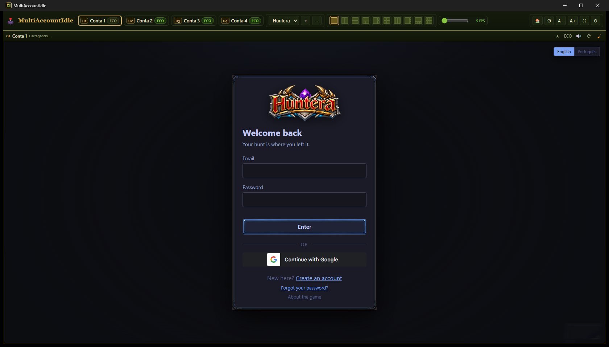

# 🕹️ MultiAccountIdle

**English** · [🇧🇷 Português](README.pt-BR.md)

A Windows desktop app to run up to **6 accounts of browser idle games** (like
[Huntera](https://huntera.com.br)) side by side — each account with its own
persistent login, an economy mode for background accounts, desktop
notifications and auto-reconnect.



> ⚠️ This app does **not** automate gameplay — it is a specialized browser that
> opens the game in independent sessions and optimizes CPU/GPU usage. The
> "idle" part is the game itself. Check each game's rules about multi-account
> usage before playing.

## Features

| Feature | How to use |
| --- | --- |
| **Up to 6 simultaneous accounts** | ⚙ → "Number of accounts". Each panel is an independent session (separate cookies/login) |
| **Rename accounts** | Double-click an account chip (e.g. use your character's name) |
| **Switch games** | "Game" selector in the top bar. `＋` adds any game by URL, `−` removes it. Sessions are kept per account, across games |
| **Screen layouts** | 10 layouts with shape previews, including a 3×2 grid for 6 accounts. Accounts outside the layout become live thumbnails in the corner (click to bring back). In **Single view** the other accounts are fully hidden while still running in the background |
| **ECO mode** | `ECO` button on a panel or its chip pill. The game keeps running at a capped FPS while the panel shows Capacity / Stamina / Lv / XP. "Eco" slider (5–30 FPS); drag "← Drag to return" to leave |
| **Auto ECO** | ⚙ → enable for non-principal accounts, or after X minutes of inactivity |
| **Windows notifications** | ⚙ → low stamina (configurable threshold), level up, disconnection |
| **Auto-reconnect** | ⚙ → reloads an account automatically if the page fails, crashes or disconnects |
| **Profiles** | ⚙ → save the current combo (game, layout, ECO states, accounts) and apply it in one click |
| **Principal account** | Click a chip, the ★ button, or `Ctrl+1..6` |
| **Zoom / Home / Reload / Fullscreen** | `A−`/`A+`/🏠/⟳/⛶ in the top bar |
| **Sound** | 🔊/🔇 per panel (ECO always mutes) |
| **Clear session** | 🧹 logs that account out of this app only (asks for confirmation) |

Everything (games, layout, names, ECO, notifications, profiles) is persisted
between sessions.

## Installation

**Players:** download `MultiAccountIdle-Setup-<version>.exe` from
[Releases](../../releases) and run it (one-click install, no admin needed).
Windows SmartScreen may warn about an unsigned app — choose "More info → Run
anyway".

**From source:**

```
git clone <this repo>
cd multiaccountidle
npm install
npm start          # run in dev mode
npm run dist       # build the app into dist/win-unpacked/
npm run installer  # build the NSIS installer into dist/
```

Requires [Node.js](https://nodejs.org) 18+.

## First use

Each panel opens the game's login screen. Log into each account manually
**once** — logins are stored in separate partitions (`persist:conta1` …
`persist:conta6`), so on the next launches all accounts sign in by themselves.
The app never touches or stores your passwords; sessions live in Chromium's
own storage.

## Tuning the status reader

Capacity/Stamina/Lv/XP values (used by the ECO panel and notifications) are
read from the **game page's text** using regex patterns written for Huntera.
For other games, adjust `mfPageBootstrap()` at the top of
[renderer/app.js](renderer/app.js) — the ECO panel shows "—" when a value is
not found.

## Project structure

```
main.js             main process (window, sessions, login popups, icon)
preload.js          safe renderer ↔ main bridge
renderer/index.html top bar + grid + config panel/modals
renderer/styles.css theme (green/gold)
renderer/app.js     logic: panels, ECO, layouts, games, notifications, profiles
build/icon.ico      app icon
```

> **Windows build tip:** if electron-builder fails with "Cannot create
> symbolic link" while extracting winCodeSign, extract the cached `.7z`
> manually into `%LOCALAPPDATA%\electron-builder\Cache\winCodeSign\winCodeSign-2.6.0`
> (the broken symlinks are macOS-only files and can be ignored) — or enable
> Windows Developer Mode.

## Author

Developed by **Alex Chang** — [alexscchang1@gmail.com](mailto:alexscchang1@gmail.com) —
with the help of [Claude Code](https://claude.com/claude-code).

## License

[MIT](LICENSE)
